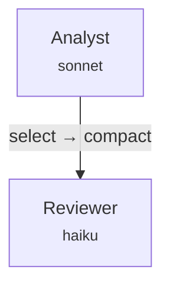

# Graft User Guide

Graft compiles `.gft` files into multi-agent pipeline structures that Claude Code can execute directly.

```
Write .gft file → graft compile → .claude/ structure generated → Run in Claude Code
```

---

## 1. Installation

```bash
npm install -g @jsleekr/graft
```

Requires Node.js 20+. Verify:

```bash
graft --version
```

---

## 2. Create a Project

```bash
graft init my-project
cd my-project
```

Creates:
```
my-project/
  pipeline.gft     ← Two-node pipeline template
```

---

## 3. Writing .gft Files

### 3.1 Context — Define Input Data

```graft
context UserRequest(max_tokens: 500) {
  question: String
}
```

- `max_tokens`: Maximum token count for this data (used in cost analysis)
- Field types: `String`, `Int`, `Float`, `Bool`, `List<T>`, `Map<K, V>`, `Optional<T>`
- Special types: `Float(0..1)` (range-bounded), `enum(low, medium, high)`, `TokenBounded<String, 100>`

### 3.2 Node — Define an Agent

```graft
node Analyst(model: sonnet, budget: 4k/2k) {
  reads: [UserRequest]
  produces Analysis {
    answer: String
    confidence: Float(0..1)
  }
}
```

- `model`: Choose from `haiku`, `sonnet`, `opus`
- `budget`: `input_tokens/output_tokens` (k = 1000)
- `reads`: Data this agent reads (context, another node's produces, or memory)
- `produces`: JSON schema this agent outputs
- `tools`: `[file_read, file_write, terminal]` (optional)
- `on_failure`: `retry(N)`, `fallback(NodeName)`, `skip`, `abort` (optional)

### 3.3 Edge — Data Flow + Transforms Between Nodes

```graft
edge Analyst -> Reviewer | select(answer, confidence) | compact
```

When data flows from Analyst to Reviewer, keep only `answer` and `confidence` fields, then remove empty values.

**Available transforms:**

| Transform | Description | Example |
|-----------|-------------|---------|
| `select(field1, field2)` | Keep only specified fields | `select(answer, confidence)` |
| `drop(field)` | Remove a specific field | `drop(reasoning_trace)` |
| `compact` | Recursively remove nulls, empty strings, empty arrays, empty objects + minify JSON | `compact` |
| `filter(field, condition)` | Filter array field by condition | `filter(issues, severity >= medium)` |
| `truncate(N)` | Proportionally reduce content to fit N tokens | `truncate(500)` |

Transforms are chainable with pipes (`|`): `select(a, b) | drop(c) | compact`

**Why this matters:** Passing full context between agents wastes tokens. Edge transforms forward only the data the next agent needs, reducing cost.

### 3.4 Graph — Define Execution Order

```graft
graph Pipeline(input: UserRequest, output: Analysis, budget: 10k) {
  Analyst -> Reviewer -> done
}
```

- `input`: Pipeline input (context name)
- `output`: Final output (produces name)
- `budget`: Total token budget

**Parallel execution:**

```graft
graph Review(input: PR, output: FinalReview, budget: 40k) {
  parallel { SecurityReviewer  LogicReviewer  PerfReviewer }
  -> SeniorReviewer -> done
}
```

All three reviewers run concurrently. Once all complete, SeniorReviewer executes.

### 3.5 Conditional Routing

```graft
edge RiskAssessor -> {
  when risk_score > 0.7 -> DetailedReviewer
  when risk_score > 0.3 -> StandardReviewer
  else -> AutoApprove
}
```

Evaluates `risk_score` from RiskAssessor's output to determine the next node.

### 3.6 Memory — Persistent State Across Runs

```graft
memory ConversationLog(max_tokens: 2k, storage: file) {
  turns: List<Turn { role: String  content: String }>
  summary: Optional<String>
}

node Responder(model: sonnet, budget: 4k/2k) {
  reads: [ConversationLog]
  writes: [ConversationLog]
  produces Response { reply: String }
}
```

Memory is stored as JSON files in `.graft/memory/` and persists between pipeline runs.

### 3.7 Import — Split Across Files

```graft
import { UserMessage, SystemConfig } from "./shared.gft"
```

Import contexts, nodes, etc. from other `.gft` files.

---

## 4. Compile

```bash
graft compile pipeline.gft
```

Generated file structure:

```
.claude/
  agents/
    analyst.md          ← Agent definition (prompt, model, tools, schema)
    reviewer.md
  hooks/
    analyst-to-reviewer.js  ← Edge transform (Node.js script)
  CLAUDE.md              ← Orchestration plan (execution order, I/O paths)
  settings.json          ← Model routing, hook registration, token budget
.graft/
  session/
    node_outputs/        ← Directory where each node's output is stored
    routing/             ← Conditional routing decisions (when conditional edges exist)
  token_log.txt          ← Token usage log
  memory/                ← Memory state (when memory declarations exist)
```

### Specify output directory

```bash
graft compile pipeline.gft --out-dir ./my-output
```

---

## 5. Running in Claude Code

### 5.1 Create Input

```bash
echo '{"question": "What are the differences between TypeScript and JavaScript?"}' > .graft/session/input.json
```

### 5.2 Launch Claude Code

```bash
claude
```

Then instruct Claude Code:

> Follow the execution plan in `.claude/CLAUDE.md`. The input is at `.graft/session/input.json`.

### 5.3 What Happens

Claude Code reads `.claude/CLAUDE.md` and executes:

1. **Step 1**: Runs the Analyst agent → saves output to `.graft/session/node_outputs/analyst.json`
2. **Hook auto-fires**: When `analyst.json` is created, `analyst-to-reviewer.js` runs automatically → creates `analyst_to_reviewer.json` (transformed data)
3. **Step 2**: Reviewer agent reads the transformed input → saves output to `.graft/session/node_outputs/reviewer.json`

### 5.4 Check Results

```bash
cat .graft/session/node_outputs/reviewer.json
```

### 5.5 Check Token Usage

```bash
cat .graft/token_log.txt
```

---

## 6. Other CLI Commands

### graft check — Validate Only

```bash
graft check pipeline.gft
```

Parses, scope-checks, type-checks, and analyzes tokens without generating files. Useful in CI.

### graft run — Compile + Execute

```bash
graft run pipeline.gft --input input.json --dry-run
```

- `--input`: Input JSON file
- `--dry-run`: Simulate execution without spawning subprocesses
- `--verbose`: Print execution details
- `--timeout <seconds>`: Subprocess timeout (default: 300)

**How `graft run` works under the hood:**

1. Compiles the `.gft` file (same as `graft compile`)
2. For each node in the execution plan, spawns a `claude` CLI subprocess
3. Each subprocess gets the agent's prompt, reads its input, and produces JSON output
4. Edge transforms run between nodes (same JavaScript hooks as in compiled output)
5. Conditional routing is evaluated after each node completes

In `--dry-run` mode, no subprocesses are spawned — the pipeline structure is validated and execution is simulated with placeholder outputs.

### graft watch — File Watcher + Auto-Recompile

```bash
graft watch pipeline.gft
```

Automatically recompiles whenever the `.gft` file changes. Useful during development alongside your editor.

### graft visualize — DAG Visualization

```bash
graft visualize pipeline.gft
```

Outputs the pipeline structure as a Mermaid diagram:



Paste into GitHub README/docs for rendered diagrams, or use [Mermaid Live Editor](https://mermaid.live) to preview.

---

## 7. Generated File Details

### .claude/agents/*.md — Agent Definitions

```markdown
---
model: claude-sonnet-4-20250514
tools: []
---

# Analyst Agent

## Task
Read the input and produce a structured Analysis.

## Input
- `.graft/session/input.json` (UserRequest)

## Output Schema
Write your output as JSON to `.graft/session/node_outputs/analyst.json`:
{
  "answer": "<string>",
  "confidence": <number 0-1>
}

When done, output: ===NODE_COMPLETE:analyst===
```

Claude Code reads the model from frontmatter and uses the content as the agent prompt.

### .claude/hooks/*.js — Edge Transform Hooks

Registered as PostToolUse hooks. When Claude Code writes a node output using the Write tool, the hook fires automatically.

Example (`analyst-to-reviewer.js`):
```javascript
const data = JSON.parse(fs.readFileSync(INPUT, 'utf-8'));
let result = {
  "answer": data["answer"],
  "confidence": data["confidence"]
};
result = compact(result);
fs.writeFileSync(OUTPUT, JSON.stringify(result));
```

### .claude/CLAUDE.md — Orchestration Plan

Describes execution order for Claude Code: which agents to run, in what order, with what inputs/outputs, and token budgets per step.

### .claude/settings.json — Settings

```json
{
  "model": "claude-sonnet-4-20250514",
  "permissions": { "allow": ["Read", "Write", "Edit", "Bash", "Skill"] },
  "graft": {
    "budget": { "total": 10000 },
    "model_routing": {
      "default": "claude-sonnet-4-20250514",
      "overrides": { "reviewer": "claude-haiku-4-5-20251001" }
    }
  },
  "hooks": {
    "PostToolUse": [{
      "matcher": "Write",
      "hooks": [{
        "type": "command",
        "command": "node .claude/hooks/analyst-to-reviewer.js",
        "if": "Write(.graft/session/node_outputs/analyst.json)"
      }]
    }]
  }
}
```

---

## 8. Examples

### Code Review Pipeline

Three reviewers analyze a PR in parallel, then a senior reviewer makes the final call.

```graft
graph AdversarialReview(input: PullRequest, output: FinalReview, budget: 40k) {
  parallel { SecurityReviewer  LogicReviewer  PerfReviewer }
  -> SeniorReviewer -> done
}
```

Edge transforms forward only key findings to the senior reviewer:
```graft
edge SecurityReviewer -> SeniorReviewer | select(vulnerabilities, severity) | compact
edge LogicReviewer -> SeniorReviewer | select(bugs, edge_cases) | compact
```

Full source: `examples/code-review.gft`

### Content Pipeline

Research → Draft → Edit → Metadata extraction. Memory references previously published articles.

```graft
graph ContentPipeline(input: Brief, output: ArticleMetadata, budget: 40k) {
  Researcher -> Drafter -> Editor -> MetadataExtractor -> done
}
```

Full source: `examples/content-pipeline.gft`

### Data Analysis Pipeline

Classify data → parallel analysis (statistics + trends) → write report.

```graft
graph DataAnalysis(input: RawData, output: AnalysisReport, budget: 50k) {
  Classifier
  -> parallel { StatAnalyzer  TrendAnalyzer }
  -> ReportWriter -> done
}
```

Full source: `examples/data-analysis.gft`

### Conditional Routing

Route to different reviewers based on risk assessment:

```graft
edge RiskAssessor -> {
  when risk_score > 0.7 -> DetailedReviewer
  when risk_score > 0.3 -> StandardReviewer
  else -> AutoApprove
}
```

Full source: `benchmarks/correctness/conditional_edge.gft`

---

## 9. Type System

```
String                    — String
Int                       — Integer
Float                     — Float
Float(0..1)               — Range-bounded float
Bool                      — Boolean
List<T>                   — List
Map<K, V>                 — Map
Optional<T>               — Optional value
TokenBounded<String, 100> — Token-bounded string
enum(low, medium, high)   — Inline enum
Issue { file: FilePath, severity: enum(low, medium, high) }  — Inline struct
```

### Domain Types

- `FilePath` — File path
- `FileDiff` — Diff text
- `TestFile` — Test file
- `IssueRef` — Issue reference

---

## 10. Error Messages

Graft provides rustc-style error messages:

```
error[SCOPE_UNDEFINED_REF]: 'Inpt' is not declared as a context, produces output, or memory
  --> pipeline.gft:6:11
   |
 6 |   reads: [Inpt]
   |           ^^^^
   |
   = help: did you mean 'Input'?
```

Typos are caught with fuzzy matching suggestions.

---

## 11. Programmatic API

```typescript
import { compile } from '@jsleekr/graft/compiler';
import { Executor } from '@jsleekr/graft/runtime';
import type { Program } from '@jsleekr/graft/types';

const result = compile(source, 'pipeline.gft');
if (result.success) {
  console.log(`Parsed ${result.program.nodes.length} nodes`);
  console.log(`Token estimate: ${result.report.bestCase}`);
  for (const file of result.files) {
    console.log(`Generated: ${file.path}`);
  }
}
```

---

## 12. Execution Model and Limitations

### How Graft Differs from Runtime Orchestrators

Graft is a **compiler**, not a runtime orchestrator like LangGraph or CrewAI.

| | Graft | LangGraph / CrewAI |
|---|---|---|
| Execution control | LLM follows generated instructions | Deterministic state machine |
| Token optimization | Compile-time analysis + edge transforms | Manual / none |
| Runtime dependency | Claude Code | Python runtime |
| Deployment | `.claude/` files, zero runtime | Application server |

**What this means in practice:**
- The orchestration plan (`.claude/CLAUDE.md`) is a natural-language prompt. Claude Code interprets it, but there's no hard guarantee of exact execution order.
- Edge transform hooks (`.claude/hooks/*.js`) are deterministic — they run as Node.js scripts triggered by PostToolUse events.
- Model routing and permissions (`.claude/settings.json`) are deterministic.
- The compile-time token analysis is deterministic.

In other words: **the data pipeline is deterministic; the orchestration is best-effort**.

### Known Limitations

- **Non-deterministic orchestration**: Claude Code usually follows `CLAUDE.md` faithfully, but complex pipelines may require explicit re-prompting.
- **Claude Code dependency**: If the `.claude/` structure format changes upstream, Graft's codegen must be updated.
- **Single provider**: Only Anthropic Claude models are supported currently.
- **Memory**: Only JSON file storage works. Database backends are specified but not implemented.
- **Conditional edge codegen**: Router hooks evaluate conditions correctly, but the orchestration plan may need Claude Code to read the routing file manually in complex cases.

## 13. Troubleshooting

### Compile error: "is not declared"

A name in `reads` references something that doesn't exist. Check your context, produces, and memory names.

### Hooks not firing

Verify the hook is registered in `settings.json` under `hooks.PostToolUse`. Check that the `if` field path matches the actual output path.

### Token budget exceeded warning

Run `graft check` to see token analysis. Either increase the node `budget` or add edge transforms to reduce the data passed between agents.

### Claude Code not following the plan

Open `.claude/CLAUDE.md` directly to inspect the execution plan. Explicitly instruct Claude Code: "Read `.claude/CLAUDE.md` and follow the execution plan."

### Path issues on Windows

Graft uses POSIX paths internally. On Windows, paths are normalized automatically — no extra configuration needed.
